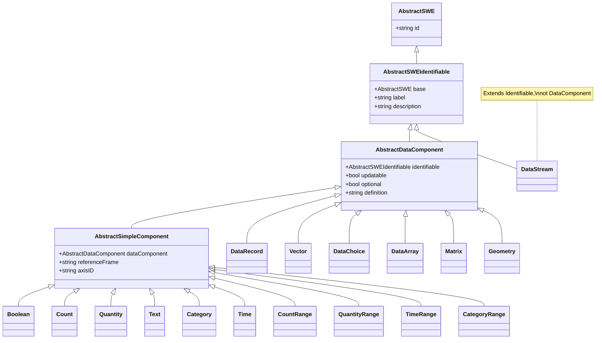
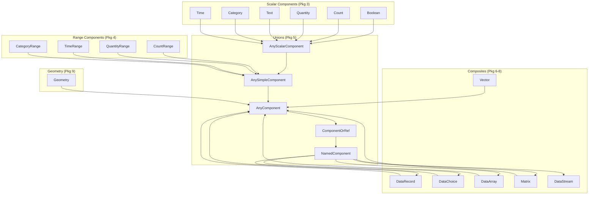
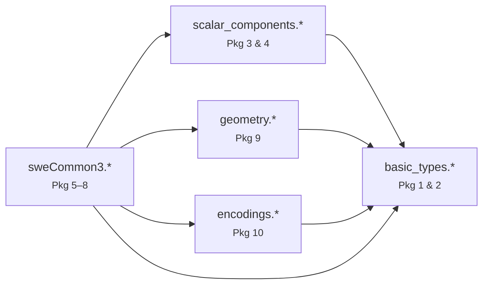
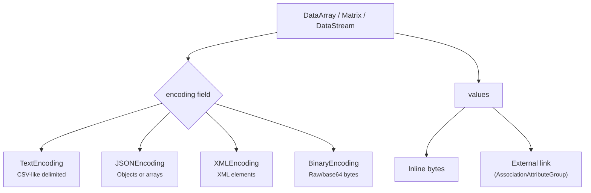

# Architecture

Visual overview of the SWE Common 3.0 type hierarchy and how components compose.

## Type inheritance hierarchy

This diagram shows how every concrete type traces back to its abstract base through embedded fields.

!!! note
    The `<|--` arrows represent conceptual inheritance. In the actual schemas, this is implemented as embedded structs/tables, not language-level inheritance.

## Component composition

This diagram shows how composite types reference other components through the union system.

## File dependency graph

How the schema files import each other:

`basic_types` is the leaf dependency — everything else imports it. `sweCommon3` (the root file) imports all four sub-schemas.

## Encoding selection flow

How the encoding system connects to data components:

For `DataStream`, values are always external (the inline option is not available).
