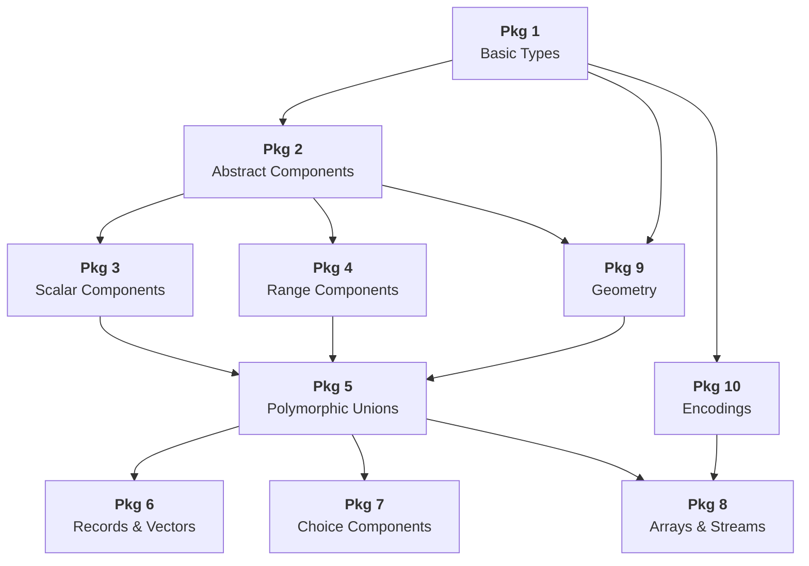

# Conceptual Guide — Overview

The OGC SWE Common Data Model 3.0 is organized into **ten packages**, each building on the ones before it. This guide explains each package from the perspective of a developer integrating these schemas into an application.

## Package map

## How the packages compose

**Packages 1–2** lay the foundation: value types (`UnitReference`, `NumberOrSpecial`, nil values, constraints) and the abstract base types that every component inherits from.

**Packages 3–4** define the leaf-level data components — scalar values like `Quantity`, `Time`, and `Category`, plus their range counterparts (`QuantityRange`, `TimeRange`, etc.).

**Package 5** introduces the polymorphic unions (`AnyComponent`, `AnyScalarComponent`, etc.) that let composite types hold any component without knowing its concrete type at compile time.

**Packages 6–8** build composite structures on top of those unions: `DataRecord` (named fields), `Vector` (coordinates), `DataChoice` (discriminated alternatives), `DataArray` / `Matrix` (homogeneous collections), and `DataStream` (observation streams).

**Package 9** (new in 3.0) adds geometry support via GeoJSON-compatible types.

**Package 10** defines how values are serialized on the wire — text (CSV), JSON, XML, or binary encoding descriptors.

## File layout across formats

Each format splits the packages across the same set of files:

| File | Packages | Contents |
|------|----------|----------|
| `basic_types.*` | 1 & 2 | Value types, abstract bases |
| `scalar_components.*` | 3 & 4 | Scalar and range components |
| `sweCommon3.*` | 5–8 | Unions, records, arrays, streams |
| `geometry.*` | 9 | Geometry types |
| `encodings.*` | 10 | Encoding descriptors |

Packages 5–8 must live in the same file because `AnyComponent`, `DataRecord`, `DataArray`, and the other composite types form a mutually referential cycle that none of the three IDLs can split across files.

## Next steps

Dive into each package:

1. [Basic Types (Pkg 1)](basic-types.md)
2. [Abstract Components (Pkg 2)](abstract-components.md)
3. [Scalar Components (Pkg 3)](scalar-components.md)
4. [Range Components (Pkg 4)](range-components.md)
5. [Polymorphic Unions (Pkg 5)](unions.md)
6. [Records & Vectors (Pkg 6)](records-vectors.md)
7. [Choice Components (Pkg 7)](choice.md)
8. [Arrays & Streams (Pkg 8)](arrays-streams.md)
9. [Geometry (Pkg 9)](geometry.md)
10. [Encodings (Pkg 10)](encodings.md)
