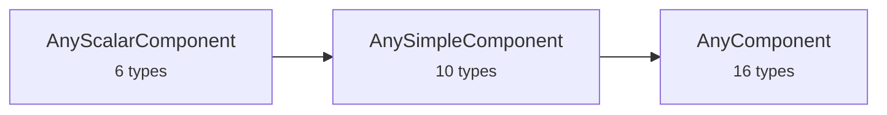

# Package 5 — Polymorphic Unions

Package 5 introduces the discriminated unions that enable polymorphism. These are the glue that lets composite types (DataRecord, DataArray, etc.) hold any component without hard-coding the concrete type.

## Union hierarchy

The unions form a hierarchy of increasing breadth:



### AnyScalarComponent

The six scalar types only:

| Variant | Type |
|---------|------|
| `boolean` | Boolean |
| `count` | Count |
| `quantity` | Quantity |
| `time` | Time |
| `category` | Category |
| `text` | Text |

### AnySimpleComponent

All scalars plus the four range types:

| Additional variants | Type |
|--------------------|------|
| `countRange` | CountRange |
| `quantityRange` | QuantityRange |
| `timeRange` | TimeRange |
| `categoryRange` | CategoryRange |

### AnyComponent

The full union — all simple types plus composite types and geometry:

| Additional variants | Type |
|--------------------|------|
| `dataRecord` | DataRecord |
| `vector` | Vector |
| `dataArray` | DataArray |
| `matrix` | Matrix |
| `dataChoice` | DataChoice |
| `geometry` | Geometry |

## ComponentOrRef

A component can be provided inline (as an `AnyComponent`) or by reference (via `AssociationAttributeGroup`). This pattern lets you share component definitions across multiple locations without duplication.

=== "Cap'n Proto"

    ```capnp
    struct ComponentOrRef {
      union {
        inline @0 :AnyComponent;
        ref    @1 :BT.AssociationAttributeGroup;
      }
    }
    ```

=== "FlatBuffers"

    ```fbs
    union ComponentOrRef {
      AnyComponentWrapper,
      AssociationAttributeGroup
    }
    ```

=== "Protocol Buffers"

    ```protobuf
    message ComponentOrRef {
      oneof kind {
        AnyComponent inline = 1;
        AssociationAttributeGroup ref = 2;
      }
    }
    ```

!!! info "FlatBuffers `AnyComponentWrapper`"
    FlatBuffers unions cannot directly contain other unions. Since `AnyComponent` is itself a union, `ComponentOrRef` cannot list it as a member directly. The `AnyComponentWrapper` table exists solely to wrap `AnyComponent` in a table so it can participate in the `ComponentOrRef` union. See the [Design Decisions](../reference/design-decisions.md) page for more detail.

## NamedComponent

A soft-named data component — the primary building block for composite types. Every field in a `DataRecord`, every item in a `DataChoice`, and the element type of a `DataArray` is a `NamedComponent`.

| Field | Type | Description |
|-------|------|-------------|
| `name` | string | Name token matching `[A-Za-z][A-Za-z0-9_-]*` |
| `component` | ComponentOrRef | The actual component (inline or by reference) |

## Working with unions in code

When you receive a message, you'll typically switch on the union discriminant:

=== "C++ (Cap'n Proto)"

    ```cpp
    auto comp = namedComponent.getComponent();
    if (comp.isInline()) {
        auto any = comp.getInline();
        switch (any.which()) {
            case AnyComponent::QUANTITY:
                auto q = any.getQuantity();
                // use q.getValue(), q.getUom(), etc.
                break;
            case AnyComponent::DATA_RECORD:
                auto rec = any.getDataRecord();
                // iterate rec.getFields()
                break;
            // ...
        }
    }
    ```

=== "Python (protobuf)"

    ```python
    which = named.component.WhichOneof("kind")
    if which == "inline":
        comp_type = named.component.inline.WhichOneof("component")
        if comp_type == "quantity_component":
            q = named.component.inline.quantity_component
            print(f"Value: {q.value.number} {q.uom.code}")
    ```
